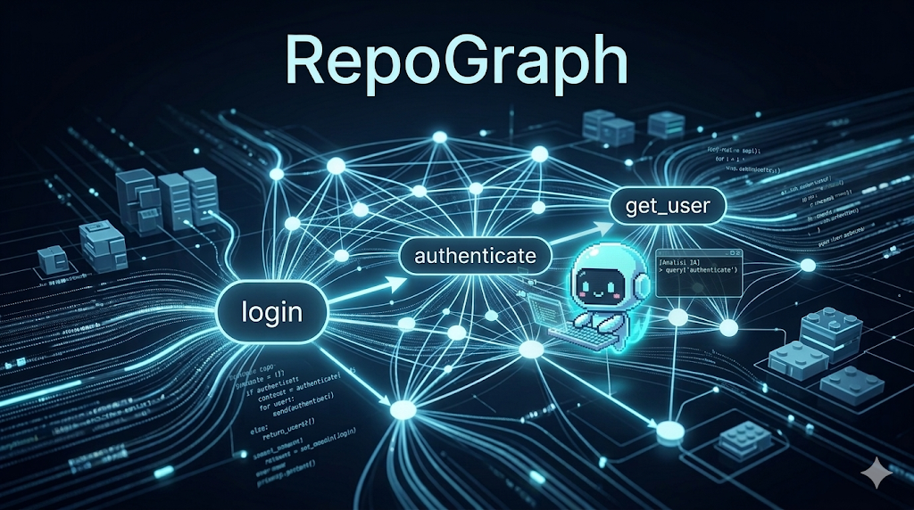

# RepoGraph

**Understand any codebase in seconds.**

RepoGraph scans a repository and builds a **function-level dependency graph** so you can instantly see how functions, files, and modules interact.

Designed for developers working with **large codebases** and AI coding tools like Claude Code.

---

## Why RepoGraph?

Modern AI coding tools struggle with **large repositories** because they need to read thousands of lines of code to understand context.

RepoGraph solves this by creating a **structural map of the repository**, showing:

* which functions call each other
* how modules interact
* what parts of the code will be affected by a change

Instead of reading the whole codebase, an AI (or developer) can query the graph and instantly understand **the relevant parts of the system**.

---

## Example

Imagine this code:

```python
def login(user):
    authenticate(user)

def authenticate(user):
    get_user(user)

def get_user(user):
    pass
```

RepoGraph builds this call graph:

```
login → authenticate → get_user
```

Now you immediately know:

* changing `get_user()` impacts `authenticate()` and `login()`
* `login()` is the entry point

---

## Features

* Repository scanning
* Function-level dependency graph
* Call graph generation
* CLI interface
* Lightweight and fast

Planned features:

* cross-file dependency graphs
* class & method analysis
* impact analysis (`what breaks if I change this?`)
* integration with AI coding agents
* persistent context files for large codebases

---

## Installation

Clone the repository:

```bash
git clone https://github.com/yourname/repograph
cd repograph
```

Create a virtual environment:

```bash
python -m venv .venv
source .venv/bin/activate
```

Install dependencies:

```bash
pip install typer networkx
```

---

## Usage

Run RepoGraph on a repository:

```bash
python cli.py index path/to/repository
```

Example output:

```
Nodes: ['login', 'authenticate', 'get_user']
Edges: [('login', 'authenticate'), ('authenticate', 'get_user')]
```

---

## CLI Query Mode

RepoGraph includes two focused commands to reduce output and speed up navigation.

### `architecture`

Returns only the symbols that match a query.

```bash
python cli/repograph_cli.py architecture path/to/repo login
```

Example output:

```json
{
  "auth.py": {
    "functions": ["login_user", "audit_login"]
  },
  "auth_service.py": {
    "classes": {
      "AuthService": {
        "methods": ["authenticate"]
      }
    }
  }
}
```

### `connections`

Returns only the calls around the matched symbols, with a depth value.

```bash
python cli/repograph_cli.py connections path/to/repo login 2
```

Example output:

```json
{
  "matched_nodes": [
    "auth.login_user"
  ],
  "connections": [
    {
      "from": "auth.login_user",
      "to": "utils.normalize_username",
      "type": "calls",
      "depth": 1
    },
    {
      "from": "auth.login_user",
      "to": "models.AuthService.issue_token",
      "type": "calls",
      "depth": 1
    }
  ]
}
```

Compact output to reduce tokens:

```bash
python cli/repograph_cli.py connections path/to/repo login 2 --compact
```

Example output:

```json
{
  "n": ["auth.login_user"],
  "e": [
    ["auth.login_user", "utils.normalize_username", 1],
    ["auth.login_user", "models.AuthService.issue_token", 1]
  ]
}
```

## Architecture

RepoGraph is built with three main components.

### Scanner

Finds all source files in the repository.

```
repo → files
```

---

### Parser

Extracts:

* functions
* function calls
* relationships

```
file → functions → calls
```

---

### Graph Builder

Builds a dependency graph using NetworkX.

```
functions → graph
```

---

## Project Structure

```
repograph/
│
├── parser/
│   ├── ast_parser.py        # estrazione di classi, metodi, funzioni
│   └── symbol_index.py      # mapping simbolo → file/linea
│
├── graph/
│   ├── call_graph.py        # grafo delle chiamate
│   ├── dependency_graph.py  # dipendenze tra moduli
│   └── execution_paths.py   # path probabili
│
├── retrieval/
│   ├── semantic_search.py   # embeddings simboli
│   └── graph_expansion.py   # espansione intelligente
│
├── context/
│   └── context_builder.py   # ranking e trimming per token
│
├── server/
│   └── api.py               # MCP / REST API
│
└── cli/
    └── repograph_cli.py

---

## Future Vision

RepoGraph could become the **structural memory layer for AI coding agents**.

Instead of reading entire repositories, agents could:

* query the dependency graph
* fetch only relevant code
* reason about impact before editing code

This makes large repositories **much easier to navigate, modify, and maintain**.

---

## Contributing

Contributions are welcome.

If you have ideas for:

* better parsing
* language support
* graph visualization
* AI integrations

open an issue or submit a pull request.

---

## License

MIT
